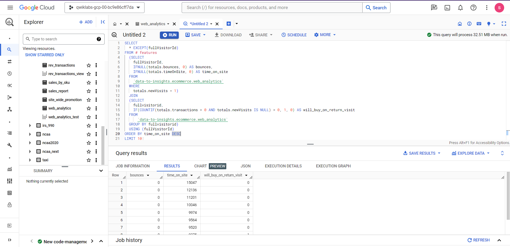

## Predicting Visitor Purchases with BigQuery ML

In this projects, following tasks will be done:
<ol>

<li>  Finding public datasets using BigQuery. Querying and exploring the ecommerce dataset. </li>
<li>  Creating a training and evaluation dataset to be used for batch prediction</li>
<li>  Creating a classification (logistic regression) model in BigQuery ML</li>
<li>  Evaluating the performance of your machine learning model</li>
<li>  Predicting and ranking the probability that a visitor will make a purchase</li>
</ol>
<hr>

### 1) Exploring ecommerce data
The percentage of website visitors who made a purchase.<br> 
```sql
#standardSQL
WITH visitors AS(
SELECT
COUNT(DISTINCT fullVisitorId) AS total_visitors
FROM `data-to-insights.ecommerce.web_analytics`
),

purchasers AS(
SELECT
COUNT(DISTINCT fullVisitorId) AS total_purchasers
FROM `data-to-insights.ecommerce.web_analytics`
WHERE totals.transactions IS NOT NULL
)

SELECT
  total_visitors,
  total_purchasers,
  total_purchasers / total_visitors AS conversion_rate
FROM visitors, purchasers
```


The result: 2.69%

Top 5 selling products:

```sql
SELECT
  p.v2ProductName,
  p.v2ProductCategory,
  SUM(p.productQuantity) AS units_sold,
  ROUND(SUM(p.localProductRevenue/1000000),2) AS revenue
FROM `data-to-insights.ecommerce.web_analytics`,
UNNEST(hits) AS h,
UNNEST(h.product) AS p
GROUP BY 1, 2
ORDER BY revenue DESC
LIMIT 5;
```


The visitors who made purchase during their return visits to the website: 

```sql
# visitors who bought on a return visit (could have bought on first as well)
WITH all_visitor_stats AS (
SELECT
  fullvisitorid, # 741,721 unique visitors
  IF(COUNTIF(totals.transactions > 0 AND totals.newVisits IS NULL) > 0, 1, 0) AS will_buy_on_return_visit
  FROM `data-to-insights.ecommerce.web_analytics`
  GROUP BY fullvisitorid
)

SELECT
  COUNT(DISTINCT fullvisitorid) AS total_visitors,
  will_buy_on_return_visit
FROM all_visitor_stats
GROUP BY will_buy_on_return_visit
```


(11873 / 729848) = 1.6% of total visitors will return and purchase from the website. This includes the subset of visitors who bought on their very first session and then came back and bought again.

### 2) Selecting features and creating our training dataset

Now we'll will create a Machine Learning model in BigQuery to predict whether or not a new user is likely to purchase in the future.

```sql
SELECT
  * EXCEPT(fullVisitorId)
FROM

  # features
  (SELECT
    fullVisitorId,
    IFNULL(totals.bounces, 0) AS bounces,
    IFNULL(totals.timeOnSite, 0) AS time_on_site
  FROM
    `data-to-insights.ecommerce.web_analytics`
  WHERE
    totals.newVisits = 1)
  JOIN
  (SELECT
    fullvisitorid,
    IF(COUNTIF(totals.transactions > 0 AND totals.newVisits IS NULL) > 0, 1, 0) AS will_buy_on_return_visit
  FROM
      `data-to-insights.ecommerce.web_analytics`
  GROUP BY fullvisitorid)
  USING (fullVisitorId)
ORDER BY time_on_site DESC
LIMIT 10;
```


### 3) Selecting a BigQuery ML model type and specifying options

We are now ready to create our first ML model in BigQuery.

```sql
CREATE OR REPLACE MODEL `ecommerce.classification_model`
OPTIONS
(
model_type='logistic_reg',
labels = ['will_buy_on_return_visit']
)
AS

#standardSQL
SELECT
  * EXCEPT(fullVisitorId)
FROM

  # features
  (SELECT
    fullVisitorId,
    IFNULL(totals.bounces, 0) AS bounces,
    IFNULL(totals.timeOnSite, 0) AS time_on_site
  FROM
    `data-to-insights.ecommerce.web_analytics`
  WHERE
    totals.newVisits = 1
    AND date BETWEEN '20160801' AND '20170430') # train on first 9 months
  JOIN
  (SELECT
    fullvisitorid,
    IF(COUNTIF(totals.transactions > 0 AND totals.newVisits IS NULL) > 0, 1, 0) AS will_buy_on_return_visit
  FROM
      `data-to-insights.ecommerce.web_analytics`
  GROUP BY fullvisitorid)
  USING (fullVisitorId);
```
### 4) Evaluating classification model performance

In ML, classification problems aim to reduce the False Positive Rate (the wrong prediction of a positive outcome) and increase the True Positive Rate (the correct prediction of a positive outcome).

A ROC (Receiver Operating Characteristic) curve is a graphical representation of this trade-off, where the goal is to maximize the AUC (Area Under the Curve).


In BigQuery ML, roc_auc is simply a queryable field when evaluating our trained ML model.

```sql
SELECT
  roc_auc,
  CASE
    WHEN roc_auc > .9 THEN 'good'
    WHEN roc_auc > .8 THEN 'fair'
    WHEN roc_auc > .7 THEN 'not great'
  ELSE 'poor' END AS model_quality
FROM
  ML.EVALUATE(MODEL ecommerce.classification_model,  (

SELECT
  * EXCEPT(fullVisitorId)
FROM

  # features
  (SELECT
    fullVisitorId,
    IFNULL(totals.bounces, 0) AS bounces,
    IFNULL(totals.timeOnSite, 0) AS time_on_site
  FROM
    `data-to-insights.ecommerce.web_analytics`
  WHERE
    totals.newVisits = 1
    AND date BETWEEN '20170501' AND '20170630') # eval on 2 months
  JOIN
  (SELECT
    fullvisitorid,
    IF(COUNTIF(totals.transactions > 0 AND totals.newVisits IS NULL) > 0, 1, 0) AS will_buy_on_return_visit
  FROM
      `data-to-insights.ecommerce.web_analytics`
  GROUP BY fullvisitorid)
  USING (fullVisitorId)));
```


Now we'll try to improve model performance with feature engineering.

```sql
CREATE OR REPLACE MODEL `ecommerce.classification_model_2`
OPTIONS
  (model_type='logistic_reg', labels = ['will_buy_on_return_visit']) AS

WITH all_visitor_stats AS (
SELECT
  fullvisitorid,
  IF(COUNTIF(totals.transactions > 0 AND totals.newVisits IS NULL) > 0, 1, 0) AS will_buy_on_return_visit
  FROM `data-to-insights.ecommerce.web_analytics`
  GROUP BY fullvisitorid
)

# add in new features
SELECT * EXCEPT(unique_session_id) FROM (

  SELECT
      CONCAT(fullvisitorid, CAST(visitId AS STRING)) AS unique_session_id,

      # labels
      will_buy_on_return_visit,

      MAX(CAST(h.eCommerceAction.action_type AS INT64)) AS latest_ecommerce_progress,

      # behavior on the site
      IFNULL(totals.bounces, 0) AS bounces,
      IFNULL(totals.timeOnSite, 0) AS time_on_site,
      totals.pageviews,

      # where the visitor came from
      trafficSource.source,
      trafficSource.medium,
      channelGrouping,

      # mobile or desktop
      device.deviceCategory,

      # geographic
      IFNULL(geoNetwork.country, "") AS country

  FROM `data-to-insights.ecommerce.web_analytics`,
     UNNEST(hits) AS h

    JOIN all_visitor_stats USING(fullvisitorid)

  WHERE 1=1
    # only predict for new visits
    AND totals.newVisits = 1
    AND date BETWEEN '20160801' AND '20170430' # train 9 months

  GROUP BY
  unique_session_id,
  will_buy_on_return_visit,
  bounces,
  time_on_site,
  totals.pageviews,
  trafficSource.source,
  trafficSource.medium,
  channelGrouping,
  device.deviceCategory,
  country);
```

Evaluation of the new model:

```sql
SELECT
  roc_auc,
  CASE
    WHEN roc_auc > .9 THEN 'good'
    WHEN roc_auc > .8 THEN 'fair'
    WHEN roc_auc > .7 THEN 'not great'
  ELSE 'poor' END AS model_quality
FROM
  ML.EVALUATE(MODEL ecommerce.classification_model_2,  (

WITH all_visitor_stats AS (
SELECT
  fullvisitorid,
  IF(COUNTIF(totals.transactions > 0 AND totals.newVisits IS NULL) > 0, 1, 0) AS will_buy_on_return_visit
  FROM `data-to-insights.ecommerce.web_analytics`
  GROUP BY fullvisitorid
)

# add in new features
SELECT * EXCEPT(unique_session_id) FROM (

  SELECT
      CONCAT(fullvisitorid, CAST(visitId AS STRING)) AS unique_session_id,

      # labels
      will_buy_on_return_visit,

      MAX(CAST(h.eCommerceAction.action_type AS INT64)) AS latest_ecommerce_progress,

      # behavior on the site
      IFNULL(totals.bounces, 0) AS bounces,
      IFNULL(totals.timeOnSite, 0) AS time_on_site,
      totals.pageviews,

      # where the visitor came from
      trafficSource.source,
      trafficSource.medium,
      channelGrouping,

      # mobile or desktop
      device.deviceCategory,

      # geographic
      IFNULL(geoNetwork.country, "") AS country

  FROM `data-to-insights.ecommerce.web_analytics`,
     UNNEST(hits) AS h

    JOIN all_visitor_stats USING(fullvisitorid)

  WHERE 1=1
    # only predict for new visits
    AND totals.newVisits = 1
    AND date BETWEEN '20170501' AND '20170630' # eval 2 months

  GROUP BY
  unique_session_id,
  will_buy_on_return_visit,
  bounces,
  time_on_site,
  totals.pageviews,
  trafficSource.source,
  trafficSource.medium,
  channelGrouping,
  device.deviceCategory,
  country)));
```
Output:


We get roc_auc of 0.91 which is significantly better than the first model.

### 5) Predicting which new visitors will come back and purchase
Finally, we will predict which new visitors will come back and make a purchase.
```sql
SELECT
*
FROM
  ml.PREDICT(MODEL `ecommerce.classification_model_2`,
   (

WITH all_visitor_stats AS (
SELECT
  fullvisitorid,
  IF(COUNTIF(totals.transactions > 0 AND totals.newVisits IS NULL) > 0, 1, 0) AS will_buy_on_return_visit
  FROM `data-to-insights.ecommerce.web_analytics`
  GROUP BY fullvisitorid
)

  SELECT
      CONCAT(fullvisitorid, '-',CAST(visitId AS STRING)) AS unique_session_id,

      # labels
      will_buy_on_return_visit,

      MAX(CAST(h.eCommerceAction.action_type AS INT64)) AS latest_ecommerce_progress,

      # behavior on the site
      IFNULL(totals.bounces, 0) AS bounces,
      IFNULL(totals.timeOnSite, 0) AS time_on_site,
      totals.pageviews,

      # where the visitor came from
      trafficSource.source,
      trafficSource.medium,
      channelGrouping,

      # mobile or desktop
      device.deviceCategory,

      # geographic
      IFNULL(geoNetwork.country, "") AS country

  FROM `data-to-insights.ecommerce.web_analytics`,
     UNNEST(hits) AS h

    JOIN all_visitor_stats USING(fullvisitorid)

  WHERE
    # only predict for new visits
    totals.newVisits = 1
    AND date BETWEEN '20170701' AND '20170801' # test 1 month

  GROUP BY
  unique_session_id,
  will_buy_on_return_visit,
  bounces,
  time_on_site,
  totals.pageviews,
  trafficSource.source,
  trafficSource.medium,
  channelGrouping,
  device.deviceCategory,
  country))
ORDER BY
  predicted_will_buy_on_return_visit DESC;

```
### Results

More than 6% of the first-time visitors with the highest predicted probability buy something in a subsequent visit. They account for almost half of all the first-time visitors who return and purchase. Only 0.7% of the first-time visitors buy something in a later visit. Focusing on the top 6% of first-time visitors boosts marketing ROI by 9 times compared to targeting all of them.

